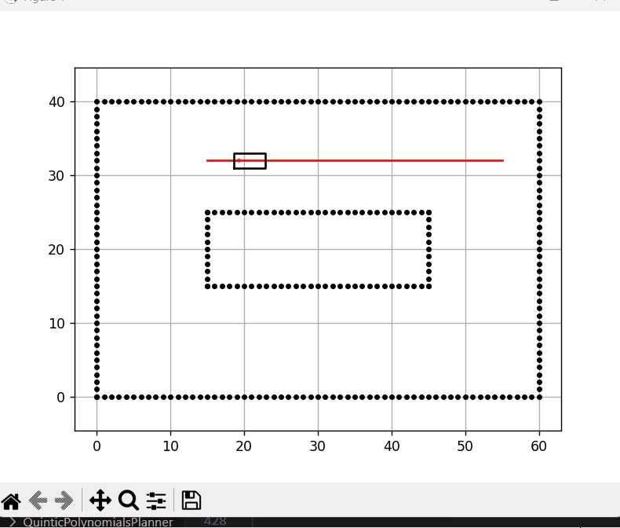
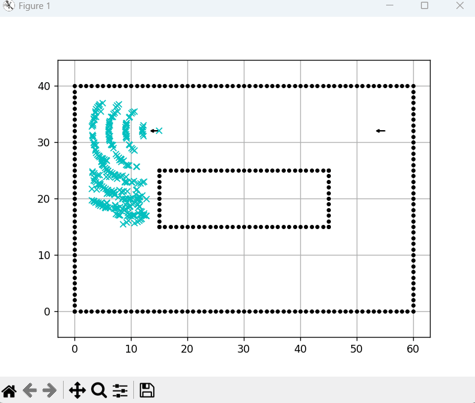

# Hybrid A* Path Planner

## 🎥 Project Demo


## 🎥 Project Demo


## 📖 Overview
This project implements the **Hybrid A* algorithm** for non-holonomic robots (Ackermann steering). It optimizes path generation by resolving conflicts between heuristic search and analytic expansion (Reeds-Shepp curves).

## 🚀 Key Features
- **Kinematic Constraints:** Enforces minimum turning radius for realistic vehicle movement.
- **Improved Goal Logic:** Checks both Position and Orientation (Yaw) at the goal.

## 🛠️ How to Run
1. Install dependencies:
   ```bash
   pip install -r requirements.txt
