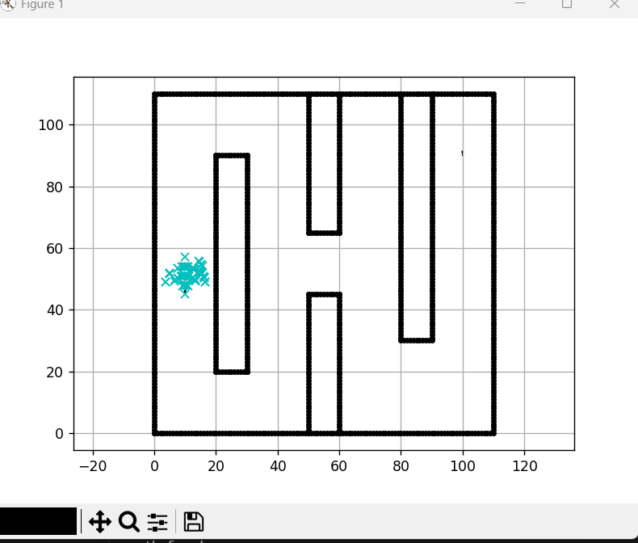

# Hybrid A* Path Planner

## 🎥 Project Demo


## 📖 Overview
This project employs the Hybrid A* algorithm and a self-developed two-dimensional mapping capability to test path planning. The results indicate that path smoothing is required; this capability is currently under development and learning.

## 🚀 Key Features
- **Kinematic Constraints:** Enforces minimum turning radius for realistic vehicle movement.
- **Improved Goal Logic:** Checks both Position and Orientation (Yaw) at the goal.

## 🛠️ How to Run
1. Install dependencies:
   ```bash
   pip install -r requirements.txt
